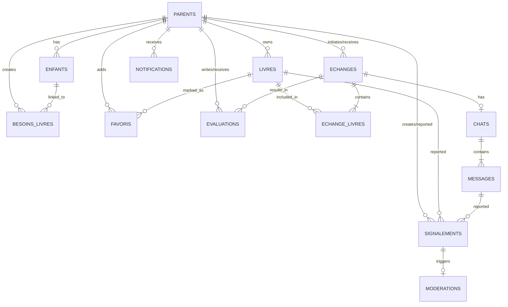

# Trocabook Backend Documentation

## Overview
This backend implementation for Trocabook is built with NestJS and Firebase (Firestore + Auth). It handles the core logic for users (parents), children, books, exchanges, chats, evaluations, notifications, and signalements.

## Data Structure Implementation
The following modules correspond to the provided schema:

### 1. **Users (Parents)**
- **Entity**: `Parent`
- **Path**: `src/users`
- **Description**: Handles registration and profile management. Stores data in `parents` collection.
- **Fields**: `id`, `nom`, `prenom`, `email`, `telephone`, `ville`, `localisation_lat`, `localisation_lng`, `image_profil`, `nombre_enfants`, `note_moyenne`, etc.

### 2. **Enfants**
- **Entity**: `Enfant`
- **Path**: `src/enfants`
- **Description**: Manages children profiles linked to parents.
- **Fields**: `nom`, `age`, `classe`, `ecole`, `matieres`, etc.

### 3. **Livres**
- **Entity**: `Livre`, `BesoinLivre`, `Favori`
- **Path**: `src/livres` (and `src/favoris` for Favoris module)
- **Description**: Manages book inventory, needs (besoins), and favorites.
- **Fields**: `titre`, `matiere`, `classe`, `etat`, `images`, `statut` (disponible, en_negociation, echange), etc.

### 4. **Echanges (Transactions)**
- **Entity**: `Echange`, `EchangeLivre`
- **Path**: `src/transactions` (Refactored to assume 'echanges' naming internally)
- **Description**: Handles the exchange process between parents.
- **Fields**: `parent_offreur_id`, `parent_demandeur_id`, `statut` (propose, accepte, en_cours, termine), `date_validation`.

### 5. **Chats**
- **Entity**: `Chat`, `Message`
- **Path**: `src/chats`
- **Description**: Real-time messaging context for exchanges.
- **Fields**: `echange_id`, `date_creation`, `statut`. Messages contain `contenu`, `image`, `date_envoi`.

### 6. **Evaluations**
- **Entity**: `Evaluation`
- **Path**: `src/evaluations`
- **Description**: Rating system after exchanges.
- **Fields**: `note` (1-5), `commentaire`, `tags`.

### 7. **Notifications**
- **Entity**: `Notification`
- **Path**: `src/notifications`
- **Description**: System for user alerts.
- **Fields**: `type`, `titre`, `message`, `lu`.

### 8. **Signalements & Moderations**
- **Entity**: `Signalement`, `Moderation`
- **Path**: `src/signalements`
- **Description**: Reporting system for bad behavior or content.
- **Fields**: `cible_type`, `motif`, `statut`. Moderation handles actions like `suspension`.

## API Endpoints (Swagger)
The API documentation is auto-generated by NestJS Swagger.
- Run `npm start`
- Visit `/api` for the Swagger UI.

## Authentication

## Entity Relationships Diagram

